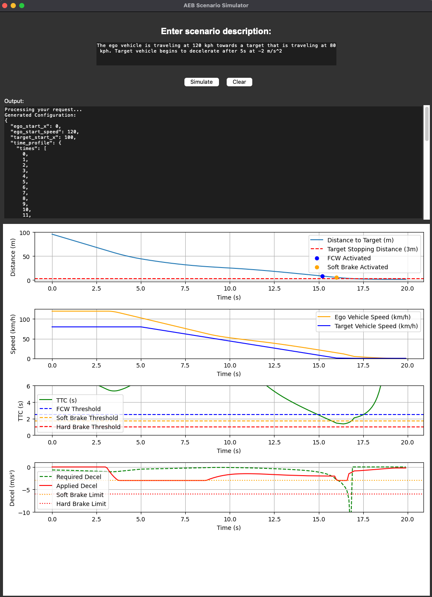

# LLM based 2D AEB/ACC scenario generator using CARLO

This tool leverages Large Language Models (LLMs) to generate and simulate Advanced Emergency Braking (AEB) and Adaptive Cruise Control (ACC) scenarios in a 2D environment. This tool allows users to:

1. **Create Scenarios in Natural Language**: Simply describe your desired traffic scenario in plain English, and the LLM will convert it into a simulation-ready configuration.

2. **Visualize AEB & ACC Performance**: CARLO renders AEB and ACC systems performance in real-time with:
   - Live speed and distance measurements
   - Forward Collision Warning (FCW) alerts
   - Real-time position and location updates

3. **Analyze Performance**: Evaluate system behavior through:
   - Time-to-collision (TTC)
   - Ego vs Target Speed
   - Distance measurements
   - Deceleration data

4. **Explore Critical Scenarios**
   1. Optimizes the allocation of simulation resources through the use of probablistic models
   2. Maximize test coverage by exploring the entire parameter space with adaptive sampling techniques
   3. Identifies the most critical scenarios by targeting the 'unknown regions' - boundaries of pass/fail within the parameter space

This tool uses CARLO (CARLA Low-budget), a lightweight and effective 2D simulator to test autonomous vehicle safety systems without the computational overhead of full 3D environments. See citation for CARLO below.





Note: the API key is free and is rate limited.


## Future Development
I am interested in further development of this tool by allowing the user to explore scenario parmeter space 
Using LLMs to generate more advanced scenario configurations
testing this framework on another scene (ex: unprotected left turn, target cut-in, highway merge)


**LHS_filter.py**
1. Determine the most salient parameters in a scene and reasonable ranges.
2. Initial sampling of the parameter space using Latin Hypercube Sampling (LHS)
3. Filtering out the unrealistic/non-critical scenarios presim, then batch simulate the scenarios
4. Filter out the scenarios with a high probability of collision or avoidance (not useful for the training stage)
--
**probalistic_model.py**
5. Train the initial Gaussian Process model using the simulation results
6. Use LHS & criticality filtering to filter to generate another set of scenario configurations
7. Predict collision probabilities (likelihood of a collision occurring in a given scenario) using GP model and calculate the uncertainty scores (model’s confidence in its probability prediction) 
8. Filter scenarios configs with a collision probability of 0.4-0.6 (borderline scenarios that are neither clear passes nor clear fails) 
9. Borderline scenarios with high uncertainty: these scenarios lie near the pass/fail boundary, and the model is unsure of their outcome (perhaps due to lack of training data). The results would be good to feed back into the dataset for retraining the model. 
10. Borderline Scenarios with Low Uncertainty: these scenarios are also on the pass/fail boundary, but the model is quite confident in its prediction. These would be good for evaluating the model, and would be critical scenarios to test the system.
11. Train the model until the model predictions are stabilized (uncertainty, collision probability, clear decision boundary)
12. The model is ready to use to create a test set of 'critical' scenarios to test the system.

Example output of ego vs target speed in the AEB example (Red - low probability of collision, blue - high probability of collision). This makes sense intuitively as most AEB systems can scrub a maximum of 45-60 kph.


## Dependencies
See requirements.txt

## Run
```python
python LLM_scn_gen.py
```

Citation for CARLO:

<pre>
@inproceedings{cao2020reinforcement,
  title={Reinforcement Learning based Control of Imitative Policies for Near-Accident Driving},
  author={Cao, Zhangjie and Biyik, Erdem and Wang, Woodrow Z. and Raventos, Allan and Gaidon, Adrien and Rosman, Guy and Sadigh, Dorsa},
  booktitle={Proceedings of Robotics: Science and Systems (RSS)},
  year={2020},
  month={July}
}
</pre>
